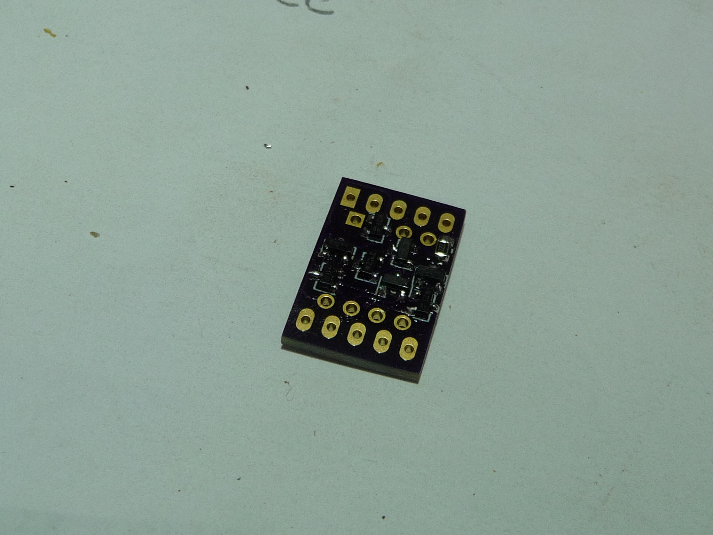

# 4b7s
a 4 bit 7 segment decoder, super simple, but not BCD!

The story is (was when I left it) at 
 https://hackaday.io/page/21308-the-7-segment-decoder-done-wrong
 

All the files you should need to send off to have them made are in
the gerber directory. I'm sorry there was no room for slikscreens :]

